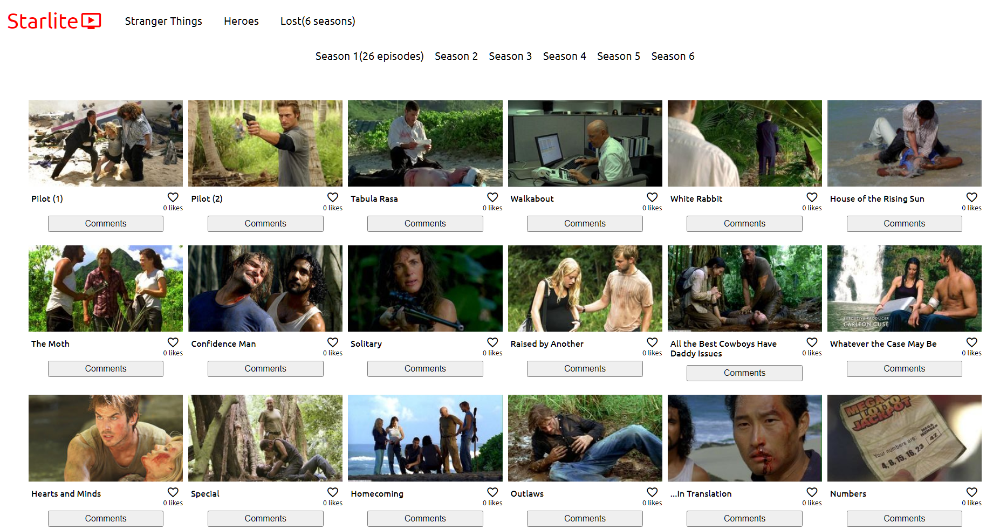

# Project Name

> On this capstone we created a website using the TvMaze API

The website displays the seasons and episodes of three chosen TV shows, as well as having a comment section for every episode connected to the involvement API, the project was built with HTML, CSS, JavaScript, bundled with Webpack and tested with Jest.

## Built With

- HTML
- CSS
- JavaScript
- Webpack
- Jest
- TvMaze API
- Involvement API

## Live Demo

[Live Demo Link](https://dyaryraoof.github.io/javascript-capstone/dist)

## Demo Video
[Demo Video](https://drive.google.com/file/d/1T2iqPsr-g0i2x4ylDuaJfs33elqP4gnw/view?usp=sharing)

## Getting Started

- Clone the repository with git clone https://github.com/leolpaz/Leaderboard.git;
- Open the cloned folder on the IDE of your choice;
- Install dependencies with npm i;
- Use npm start to start the website;
- Use npm run test to run the tests;

## Authors

👤 **Leonardo Paz**

- Github: [Leonardo Paz](https://github.com/leolpaz)
- Twitter: [Leonardo Paz](https://twitter.com/leonardolpaz95)
- Linkedin: [Leonardo Paz](https://www.linkedin.com/in/leonardo-paz-a925611b5/)

👤 **Dyary Raoof Bayz**

- GitHub: [@DyaryRaoof](https://github.com/DyaryRaoof)
- Twitter: [@DyaryRaoof](https://twitter.com/DyaryRaoof)
- LinkedIn: [@DyaryRaoof](https://linkedin.com/in/DyaryRaoof)

## 🤝 Contributing

Contributions, issues, and feature requests are welcome!

Feel free to check the [issues page](../../issues/).

## Show your support

Give a ⭐️ if you like this project!

## Acknowledgments

- Hat tip to anyone whose code was used
- Microverse
- TvMaze API for their amazing public API

## 📝 License

This project is [MIT](./MIT.md) licensed.
